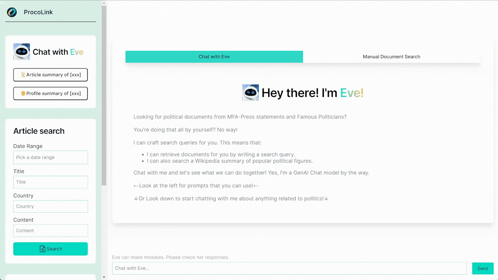

# PopFigExpert - Document AI Companion powered with GenUI

|            | <div align="center"><span style="font-size: large;">**Discover the homepage.<br>Engage with an intuitive chat interface.<br>Experience seamless AI interactions.**</span></div>                  |
| ----------------------------------------------------- | ------------------------------------------------------------------------------------------------------------------------------------------------------------------------------------------------ |
|      | <div align="center"><span style="font-size: large;">**Request AI-driven summaries.<br>Receive concise reports.<br>Analyze key documents effectively.**</span></div>                              |
|  | <div align="center"><span style="font-size: large;">**Access detailed personality insights.<br>Utilize extensive data synthesis.<br>Explore profiles of prominent figures.**</span></div>        |
|             | <div align="center"><span style="font-size: large;">**Search documents with advanced filters.<br>Locate articles by date, title, and more.<br>Supports detailed profile searches.**</span></div> |

PopFigExpert is an AI-powered information assistant designed to provide accurate and comprehensive information about popular figures, historical events, and current affairs. Built using Next.js, React, and Tailwind CSS, this application leverages the power of OpenAI's GPT-3.5 Turbo and Anthropic's Mixtral 7x8b models to deliver a seamless and interactive user experience.

Special mention to Centre of Strategic Infocomms Technology (CSIT), for assigning this amazing project to me!
Thank you Yai Hui, for guiding and assisting me from things to model selection, payment of AI credits, and allowing me to work with Next.js!

## TODO

- [x] Scrape and ingest MFA-Press Statements into Elasticsearch
- [x] Scrape and ingest Wikipedia articles into Elasticsearch
- [x] Basic chatbot functionality with OpenAI API and Mixtral model support
- [x] Set up Vercel AI SDK
- [x] UI for interacting with the chatbot
- [x] Function calling capabilities with OpenAI
- [x] Function calling capabilities with Mixtral
- [x] UI for interacting with Elasticsearch
  - [x] Search Input, Sorting and Filters
  - [x] Implement date handling functionality
  - [x] Search for documents on key press
  - [x] Include reset button to clear all filters and search results
- [x] Integrate model's Function calling with Elasticsearch:
  - [x] Implement chatbot's ability to generate Elasticsearch queries based on user input
  - [x] Process and present Elasticsearch results to the user within the chat interface
  - [x] UI for displaying and sending inputs within the genUI.
     

## Features

- **AI-Powered Chatbot**: Engage in natural language conversations with Eve, an AI assistant trained to provide information from a curated document database.
- **Customizable AI Models**: Choose between OpenAI's GPT-3.5 Turbo and Anthropic's Mixtral 7x8b models to power the chatbot's responses.
- **Document Search**: Perform manual searches on the document database using filters such as content, date, title, and country.
- **Report Summarization**: Request report summaries on specific topics, and the AI assistant will synthesize information from relevant documents to provide concise summaries.
- **Personality Summaries**: Obtain "Wikipedia-style" summaries about notable individuals based on information from the document database.
- **Citation Integration**: The AI assistant incorporates citations using Markdown linking, embedding the source URLs within the summarized information for transparency and credibility.
- **Chat History**: Easily navigate through previous chat conversations and continue where you left off.
- **Responsive Design**: The application is designed to be responsive and accessible across various devices and screen sizes.

## Architecture


## Getting Started

To run the PopFigExpert application locally, follow these steps:

1. Clone the repository:

   ```
   git clone https://github.com/pclk/PopFigExpert
   ```

2. Install the dependencies:

   ```
   cd src
   npm i
   ```

3. Set up the required environment variables:

   - Create a `.env.local` file in the root directory.
   - Add the necessary environment variables, such as API keys and Elasticsearch configuration.

4. Start the development server:

   ```
   npm run dev
   ```

5. Open your browser and navigate to `http://localhost:3000` to access the application.

## Customiation

You can customize:

- **AI Model**: We already set up OpenAI and Mixtral, meaning you can freely add your preferred OpenAI or Mistral models. However, for other models, you would have to code it yourself.
- **User Interface**: The UI is built with Tailwind CSS and shadcn. You can modify the design from the tailwind to match your desired design aesthetics.
- **Document Database**: We use Elasticsearch as our document database. You can customize the configuration there.

## Future Improvements

- [ ] Integrate Clerk for user authentication and authorization
- [ ] Ability to select documents from searches, and bring them into the chat intuitively.
- [ ] Ability to search documents through an @mention in the chat, and bring it into the chat.

## Contact

If you have any questions, suggestions, or feedback regarding PopFigExpert, please feel free to reach out me at [weiheng@proco.link](mailto:weiheng@proco.link).

Happy exploring with PopFigExpert!

maybe i should start a nextjs project on benchmarking llms on your own questions.

// Frontend Libraries
"next": "latest",
"react":
"tailwindcss-animate": "latest",
"tailwind-merge": "latest",
"clsx": "latest",
"lucide-react": "latest",
"shadcn-ui": "latest"

// Headless UI Libraries
"@radix-ui
"react-datepicker": "latest",
"react-day-picker": "latest",
"react-highlight-words": "latest",
"react-markdown": "latest",
"react-textarea-autosize": "latest"

// State Management
"zustand": "latest",
"nuqs": "latest"

// GenAI Tools
"@ai-sdk/mistral": "latest",
"@mistralai/mistralai": "latest",
"ai": "latest"

// Data Handling
"date-fns": "latest",
"lodash": "latest",
"zod": "latest",
"zod-to-json-schema": "latest",
"remark-gfm": "latest"

ngrok elasticsearch docker
